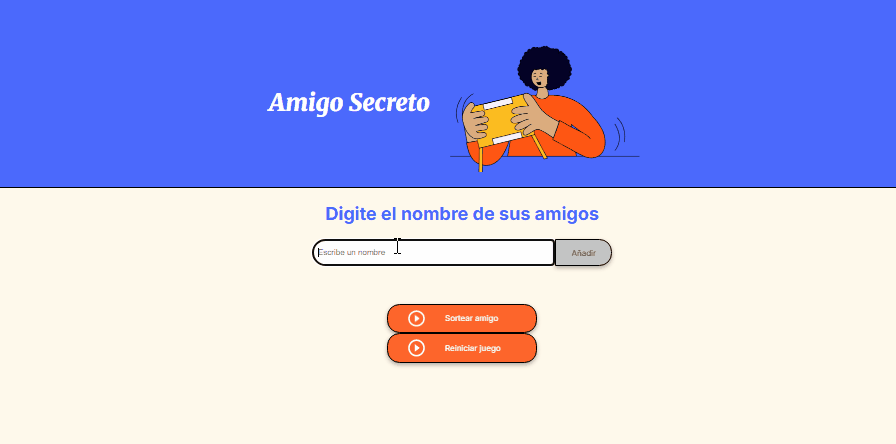

# 🎁 Amigo Secreto
Este proyecto es una aplicación web sencilla para organizar un sorteo de Amigo Secreto. Permite agregar nombres de pamigos, eliminarlos si es necesario, y realizar un sorteo aleatorio para seleccionar alx Amigo Secreto. 🎉

## 🚀 Características
- Agregar nombres a la lista de participantes.
- Validaciones para evitar nombres repetidos o caracteres inválidos.
- Eliminar nombres si es necesario.
- Seleccionar aleatoriamente un amigo secreto sin repetir.
- Mostrar el resultado con una imagen.
- Opción para reiniciar el juego.

## ## 🎥 Vista previa  

## 📋 Requisitos
Solo necesitas un navegador web para ejecutar el proyecto.

## 🔧 Instalación y Uso
1. Clona este repositorio o descarga los archivos.
2. Abre el archivo `index.html` en tu navegador.
3. Ingresa los nombres de los participantes.
4. Haz clic en **Sortear amigo** para ver el resultado.
5. Usa el botón **Reiniciar** para volver a jugar con los nombres restantes.

## 🛠️ Tecnologías utilizadas
- HTML.
- CSS.
- JavasScritp.